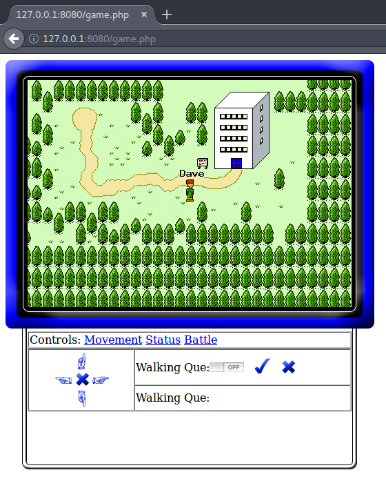

MopRpg
======

**A game I wrote a long time ago.**

Setup
-----

You need the docker images:
- [dpedu/nginxfpm](http://gitlab.davepedu.com/dave/docker-nginxfpm)
- [dpedu/mariadb](http://gitlab.davepedu.com/dave/docker-mariadb)

Steps:

- `docker-compose up`
- `docker exec -i moprpg_mysql_1 mysql < init.sql`
- browse to [http://127.0.0.1:8080/](http://127.0.0.1:8080/)
